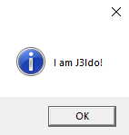

# 👋 Hi, I’m J3ldo  

```python  
import vbspython as vbs  

me = vbs.system('whoami').strip("\n")  
vbs.msgbox(f"I am {me}!", icon=vbs.itemattributes().msgbox().icons().information())  
```


# Repositories
## Python
<!--<a href="j3ldo.ddns.net">My own site.</a>-->
[Limited Sniper](https://github.com/J3ldo/LimitSniper) Gets the price of limiteds on the roblox catalog.  
[Folder Zipper](https://github.com/J3ldo/Folder-Zipper) Zips directories into one file. And can unzip them.  
[Config Reader](https://github.com/J3ldo/ConfigReader) Is a program that can read .ini files.  
[Vbspython](https://github.com/J3ldo/vbspython) A python module to interact with vbscript (Only works for windows operating systems)  
[Site Stats](https://github.com/J3ldo/SiteStats) Enables the possibility for you to see stats for your site!  
[Prime Numbers](https://github.com/J3ldo/PrimeNumbers) A program that finds an amount of prime numbers given. Will format into a list and give the output. Also has a list of 100,000 prime numbers  

<!--[Wifi password scraper](https://github.com/J3ldo/Wifi-Password-Scraper) Scrapes all registerd passwords of a device with windows on it  
[Video downloader](https://github.com/J3ldo/VideoDownloader) Will download youtube videos fast and for free! -->
<!-- [Sus-Bot](https://discordbotlist.com/bots/sus-bot) One of my biggest projects. Sus bot is a bot for discord thats closed source and in 34 server atm   -->
 
## HTML/PHP
[Share files locally](https://github.com/J3ldo/Share-Files-Locally) Want to share files but you aren't able to? Host this on any network to share and upload files between devices

## Collaboration and Commissions
I accept commissions for python and python + html.  
I am also looking to collaborate on python. So feel free to ask.

## Contact information:  
Discord: Jeldo#9587  
Mail: <a href="mailto:jeldojelle@gmail.com">jeldojelle@gmail.com</a>


<!---
- 👋 Hi, I’m J3ldo
- 👀 I’m interested in programming
- 🌱 I’m currently learning Python, HTML and Php
- 💞️ I’m looking to collaborate on Python
- 👩‍💻 Upvote my biggest project so far <a href="https://discordbotlist.com/bots/sus-bot">Sus Bot</a>
- 📫 How to reach me? Through discord my username is: Jeldo#9587
- 💻 Follow me <a href="https://www.youtube.com/watch?v=dQw4w9WgXcQ">here</a>
--->

<!---
J3ldo/J3ldo is a ✨ special ✨ repository because its `README.md` (this file) appears on your GitHub profile.
You can click the Preview link to take a look at your changes.
--->
